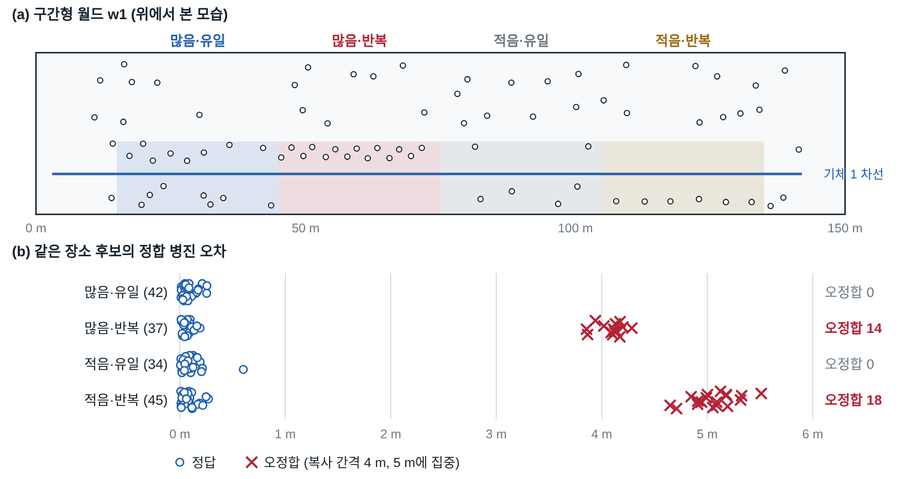
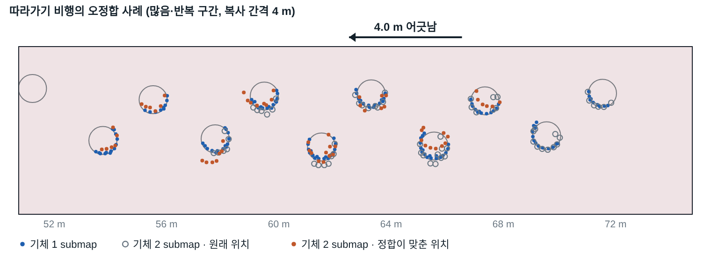
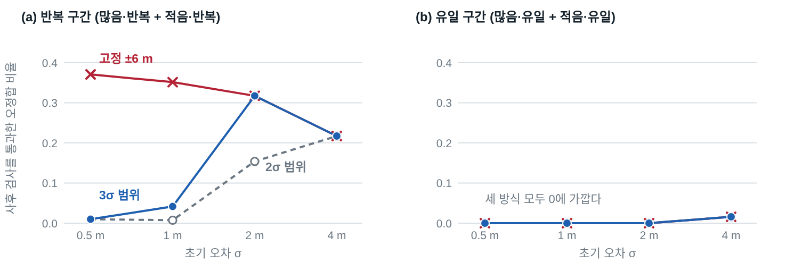
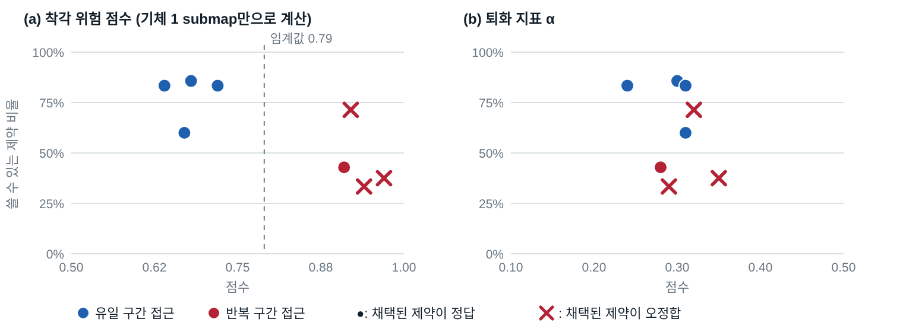
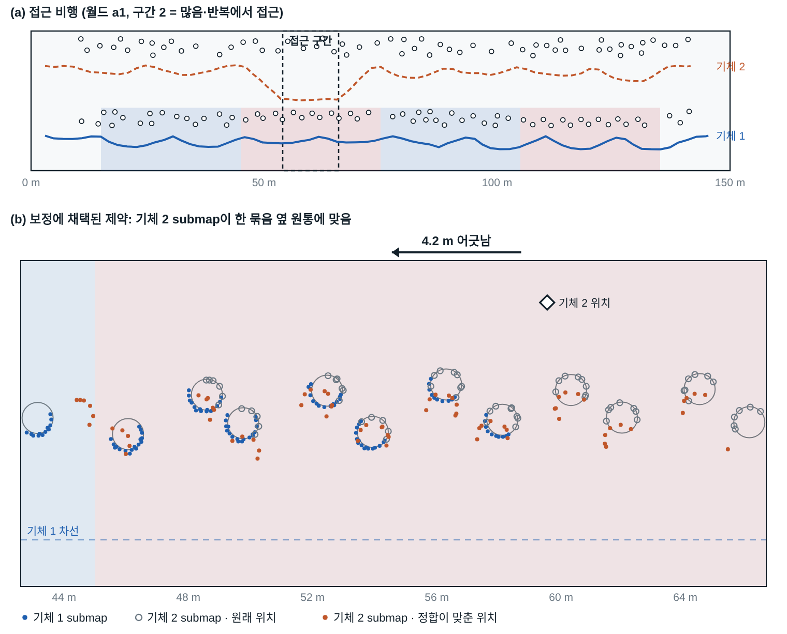

# 반복 구조 환경에서 다중 UAV LiDAR 지도 정합의 착각 위험 예측: 앞 드론 지도를 이용한 만남 구간 평가

초안 v1.1 · 2026-10-07 · 저자·소속 미기입

## 초록

복귀 없이 한 방향으로 비행하는 다중 UAV 임무에서는 각 기체가 지나온 곳을 다시 관측하지 않으므로 자기 loop closure로 SLAM 오차를 줄일 수 없다. 대신 한 기체가 관측한 장소를 다른 기체가 나중에 관측하면 두 LiDAR 부분 지도(submap)를 정합해 기체 간 제약을 만들 수 있다. 본 논문은 이 정합이 실패하는 원인을 통제된 시뮬레이션으로 분리하고, 정합 전에 실패 위험을 예측하는 지표를 제안한다. 비슷한 물체 배치가 반복되는 구간에서는 정합이 반복 간격만큼 떨어진 다른 위치에 수렴하는 착각(perceptual aliasing)이 발생하였다. 이 오정합은 기존의 퇴화(degeneracy) 지표로 구별되지 않았고, 겹침·잔차 기반 사후 검사의 대부분을 통과하였다. 제안하는 착각 위험 점수는 앞 기체의 submap을 앞 기체 자신의 지도 위에서 정합 탐색 범위만큼 옮겨, 다른 위치에서의 최고 일치도와 제자리 일치도의 비로 정의한다. 같은 경로를 따라가는 비행 8회에서 이 점수는 오정합을 AuROC 0.86으로 예측하였고(퇴화 지표 0.74), 착각의 발생은 기체 간 초기 오차의 크기가 아니라 정합 탐색 범위 안에 닮은 장소가 있는지로 결정됨을 확인하였다. 뒤 기체가 자기 차선에서 한 구간만 접근하는 비행 8회에서는, 비행 전에 고정한 네 가지 판정이 모두 성립하였다. 앞 기체의 submap만으로 계산한 점수는 8회 모두 구간의 위험 여부를 맞혔고, 반복 구간에 접근한 4회 중 3회에서 약 4 m 어긋난 제약이 보정에 채택되었다.

**주제어:** 다중 UAV, 협업 SLAM, LiDAR 정합, perceptual aliasing, 퇴화, 만남 계획

## 1. 서론

터널, 통로, 선형 구조물 점검처럼 목표 지점까지 한 방향으로만 이동하는 임무에서는 로봇이 과거 위치로 돌아오지 않는다. scan matching 기반 2D LiDAR SLAM은 이런 임무에서 loop closure를 얻지 못해 위치 오차가 이동 거리에 따라 누적된다. 여러 기체가 함께 비행하면 다른 방법이 생긴다. 앞 기체가 지나간 장소를 뒤 기체가 시간차를 두고 관측하면, 두 기체의 submap을 정합해 상대 pose 제약을 만들고 pose graph에 넣어 두 궤적을 함께 보정할 수 있다 [1–4].

이때 두 기체가 **어디에서** 같은 장소를 관측하게 할 것인지가 문제다. 본 연구의 선행 실험에서는 같은 비행 기록에서도 어느 구간의 제약을 쓰느냐에 따라 개선되는 지표가 달랐다. 또한 기둥처럼 비슷한 물체가 반복되는 환경에서는 submap이 실제와 다른 위치에 잘 맞아 버리는 오정합이 생길 수 있다. 기존 연구는 정합의 신뢰도를 주로 두 가지 방식으로 다룬다. 하나는 관측 기하가 위치를 충분히 구속하는지를 보는 퇴화 분석이고 [5–7], 다른 하나는 정합 후에 여러 제약의 상호 일관성으로 이상치를 걸러 내는 방식이다 [8–10]. 전자는 구속이 부족한 경우를 대상으로 하므로, 구속은 충분하지만 닮은 장소가 여러 곳인 경우를 다루지 않는다. 후자는 정합이 끝난 뒤에만 적용할 수 있어, 뒤 기체가 그 장소까지 이동한 비용은 이미 지불된 뒤다.

본 논문은 다음 질문을 다룬다. **뒤 기체가 도착하기 전에, 앞 기체의 지도만으로 그 구간의 정합이 착각으로 실패할 위험을 판단할 수 있는가.** 기여는 다음과 같다.

1. 퇴화와 착각을 구간 단위로 분리한 시뮬레이션 환경을 설계하고, 2-UAV 2D LiDAR 정합에서 오정합이 반복 구간에서만, 반복 간격과 같은 크기로 발생함을 보였다. 이 오정합은 퇴화 지표로 구별되지 않고 사후 검사의 대부분을 통과하였다.
2. 앞 기체의 submap과 지도만으로 계산하는 착각 위험 점수를 정의하고, 이 점수가 오정합을 예측함을 보였다.
3. 착각의 발생이 기체 간 초기 오차의 크기가 아니라 정합기의 탐색 범위 안에 닮은 장소가 있는지로 결정됨을 보였다. 탐색 범위를 예상 오차에 맞춰 줄이면 초기 오차가 작을 때 착각이 사라진다.
4. 뒤 기체가 선택한 구간에서만 접근하는 비행에서, 비행 전에 고정한 판정 기준으로 위 결과를 검증하였다.

## 2. 관련 연구

**다중 로봇 SLAM과 기체 간 loop closure.** DOOR-SLAM [1], Kimera-Multi [2], DCL-SLAM [3] 등은 descriptor나 submap을 교환해 기체 간 loop closure 후보를 찾고, 기하 정합 뒤 pose graph를 최적화한다. 이들에서 기체 간 재관측은 탐사 과정에서 우연히 생기며, 재관측 위치를 계획 대상으로 삼지 않는다.

**이상치 제거.** PCM [8]은 서로 일관된 loop closure의 최대 집합을 찾고, GNC [9]는 강건 비용으로 이상치의 영향을 줄인다. 이 방법들은 정합이 끝난 제약들에 적용된다. 본 논문의 파이프라인도 겹침·잔차·점수 차 검사와 이웃 제약의 일관성 검사를 쓰며, 실험에서 이 사후 검사가 착각을 걸러 내는 정도를 측정한다.

**정합 위험과 퇴화.** Zhang과 Singh [5]은 최적화 문제의 정보 행렬 고유값으로 퇴화 방향을 판별하였다. Censi [6]는 ICP 공분산의 닫힌 형태를 제시하였다. Nobili 등 [7]은 두 점군의 겹침과 정합 가능성(alignability, 법선 분포로 계산한 구속 행렬의 조건)으로 정합 실패 위험을 학습해, 위험이 높은 정합을 건너뛰게 하였다. 이 지표들은 관측이 위치를 구속하는 정도를 재며, 구속은 충분하지만 여러 위치가 같은 정도로 맞는 경우는 대상이 아니다.

**loop closure를 고려한 계획.** Li 등 [4]은 다중 UGV 탐사에서 기체 간 loop closure 후보의 정보 이득을 평가해 작업 할당과 경로에 반영하였다. 재관측의 가치는 불확실성 감소로 평가하며, 그 재관측의 정합이 착각으로 실패할 위험은 평가 대상이 아니다. 본 논문은 정합 전 위험 예측을 다루어 이 계열의 계획에 넣을 수 있는 항을 제공한다.

## 3. 문제 설정과 시스템

### 3.1 시나리오

두 기체가 길이 150 m, 폭 30 m의 통로를 한 방향으로 비행한다. 기체 1은 자기 차선을 따라 먼저 비행하며 submap을 만든다. 기체 2는 시간차를 두고 비행하며, 기체 1이 관측한 장소 중 일부를 관측한다. 두 기체의 출발 위치 관계는 알려져 있다고 가정한다. 비행 중 통신과 실시간 경로 변경은 다루지 않으며, 정합과 보정은 비행 기록으로 수행한다.

### 3.2 정합 파이프라인

각 기체는 scan matching 기반 2D SLAM(slam_toolbox [11], loop closing 비활성)으로 pose를 추정한다. 이동 2 m마다 keyframe을 두고, keyframe 앞뒤 5 m 구간의 scan을 모아 0.2 m voxel로 줄인 점 집합을 submap으로 쓴다. 점이 80개 미만인 submap은 쓰지 않는다.

1. **후보 검색.** 6 m 간격의 기준 keyframe마다, 두 기체의 추정 위치 차가 22 m 이내인 상대 submap 중 점 사이 거리 히스토그램이 가장 비슷한 2개와 가장 가까운 2개를 후보로 삼는다.
2. **정합.** 두 기체의 SLAM 추정에서 얻은 상대 pose를 초기값으로, 병진 ±6 m(1 m 간격)·회전 ±30°(5° 간격)의 격자를 전부 평가한다. 비용은 양방향 최근접 거리를 0.6 m에서 자른 평균(truncated symmetric Chamfer)이다. 비용이 낮은 서로 다른 8개 가설을 각각 국소 최적화한다.
3. **사후 검사.** 겹침 비율 0.25 이상, inlier RMSE 0.35 m 이하, 1·2위 가설의 비용 차 2% 이상, 초기값 대비 보정량 6 m·15° 이하를 모두 만족해야 한다. 또한 4–20 m 떨어진 다른 기준점의 통과 후보가 1.5 m·5° 이내로 같은 보정을 지지해야 한다.
4. **보정.** 통과한 후보 중 대표 제약을 기체 내 연속 keyframe 제약(σ 0.15 m, 2°), 출발 pose prior와 함께 SE(2) pose graph에 넣고 Huber 비용으로 최적화한다. 기체 간 제약의 σ는 0.30 m, 5°다.

Ground truth(GT)는 채점과 실험 조건 구성에만 쓰며, 검색·정합·검사·보정에는 쓰지 않는다.

## 4. 착각 위험 점수

### 4.1 정의

기체 1의 submap $S$와, 기체 1이 자신의 추정 pose로 submap들을 놓아 만든 지도 $M_1$만 사용한다. $S$를 pose $p$에 놓았을 때 $M_1$의 점유 셀(해상도 0.1 m, 허용 반경 0.3 m)에 닿는 점의 비율을 $m(p)$라 하자. $S$의 원래 pose를 $p_0$, 정합기의 병진 탐색 범위를 $W$라 할 때 착각 위험 점수는

$$a(S; W) = \frac{\max_{p \in \mathcal{N}_W(p_0) \setminus \mathcal{E}(p_0)} m(p)}{m(p_0)}$$

이다. $\mathcal{N}_W(p_0)$는 $p_0$에서 병진 ±$W$(0.5 m 간격), 회전 ±30°(5° 간격) 이내의 pose 집합이고, $\mathcal{E}(p_0)$는 정답으로 간주할 제자리 근방(병진 1.5 m, 회전 10° 이내)이다. 값이 1에 가까우면 탐색 범위 안에 제자리만큼 잘 맞는 다른 위치가 있다는 뜻이다. 이 점수는 기체 2의 관측 없이 계산되므로, 기체 2가 그 장소에 도착하기 전에 얻을 수 있다.

### 4.2 퇴화 지표와의 차이

비교 대상인 퇴화 지표 α는 Nobili 등 [7]의 정합 가능성 개념을 2D에 적용한 것으로, submap 각 점의 법선 $n_i$(반경 0.6 m 이웃의 주성분 분석)로 만든 행렬 $\sum_i n_i n_i^\top$의 최소·최대 고유값 비다. α가 낮으면 한 방향의 구속이 부족하다. α는 한 submap 안의 법선 분포만 보고, 착각 위험 점수는 submap이 주변의 다른 위치와 얼마나 닮았는지를 본다. 기둥이 많은 구간은 배치가 반복되든 아니든 법선이 모든 방향으로 분포하므로 α가 높다.

## 5. 실험 환경

### 5.1 시뮬레이션

PX4 SITL v1.14, Gazebo Classic 11, ROS 2 Humble, MAVROS를 사용하였다. 기체는 360° 2D LiDAR(360 빔, 최대 8 m, 거리 잡음 σ 0.01 m)를 탑재한 쿼드로터 2대이며, 고도 3 m, 속도 약 0.45 m/s로 비행한다. 장애물은 반지름 0.5 m의 원통이다.

### 5.2 구간형 월드

기체 1 차선 주변의 x = 15–135 m를 30 m 구간 4개로 나누고, 구간마다 원통 배치 규칙을 달리하였다.

| 구간 | 원통 수 / 30 m | 배치 |
|---|---:|---|
| RU (많음·유일) | 15 | 무작위 |
| RR (많음·반복) | 14 | 원통 2개 묶음을 4 m마다 복사, 묶음마다 ±0.15 m 섭동 |
| SU (적음·유일) | 6 | 무작위 |
| SR (적음·반복) | 6 | 원통 1개를 5 m마다 복사, ±0.15 m 섭동 |

반복 간격은 정합 탐색 범위(±6 m)보다 짧게 정하였다. 완전한 복사는 1·2위 비용이 같아져 사후 검사가 항상 거르므로, 작은 섭동을 주어 거의 같은 배치로 만들었다.

- **따라가기용 월드 w1–w4.** 네 구간 종류의 순서를 4×4 라틴 방진으로 배치해, 각 종류가 네 위치에 한 번씩 오게 하였다. w1·w2는 설정값을 정하는 데, w3·w4는 평가에 사용하였다.
- **접근용 월드 a1–a4.** 기체 1 쪽 원통을 두 차선 사이(y = −5.3 ~ −2.2 m)에만 두고, 기체 2 차선(y = +7.5 m) 쪽에는 원통 60개를 두었다. 구간은 RU와 RR만 번갈아 배치하고(a1·a3: RU–RR–RU–RR, a2·a4: RR–RU–RR–RU) 시드를 달리하였다. 이 배치는 시험 비행에서 확인한 두 조건을 반영한 것이다(6.3절).

### 5.3 평가 지표

두 submap을 GT로 정렬했을 때 겹치는 비율이 기준 이상인 후보를 **같은 장소 후보**로 본다. 정합 결과의 병진 오차 1 m 이하, 회전 오차 5° 이하를 **정답**으로 본다. **쓸 수 있는 제약**은 정답이면서 사후 검사를 통과한 후보다. 예측 성능은 점수가 오정합을 가르는 정도를 AuROC로 측정한다. 보정 효과는 비행 끝에서 두 기체의 상대 위치 오차(종단 상대 오차)로 측정한다.

## 6. 실험 결과

### 6.1 실험 1: 같은 경로를 따라갈 때 — 착각의 발생과 예측

기체 2가 약 30초 뒤 기체 1과 같은 차선을 따라가게 하여, 모든 구간에서 같은 장소 후보가 생기게 하였다. 이는 경로 차이로 인한 오정합을 배제하고 장소의 영향만 보기 위한 조건이다. w1–w4에서 2회씩 총 8회 비행하였고, 구간 경계 ±7 m를 제외한 같은 장소 후보는 158개였다.

**표 1. 구간별 정합 결과 (같은 장소 후보)**

| 구간 | 후보 | 오정합 | 사후 검사 통과한 오정합 | α 중앙값 | 착각 위험 점수 중앙값 |
|---|---:|---:|---:|---:|---:|
| RU | 42 | 0 | 0 | 0.51 | 0.49 |
| RR | 37 | 14 | 12 | 0.51 | 0.93 |
| SU | 34 | 0 | 0 | 0.36 | 0.52 |
| SR | 45 | 18 | 18 | 0.30 | 0.86 |

오정합 32건은 모두 반복 구간에서 발생하였다. 병진 오차는 RR에서 3.9–4.3 m, SR에서 4.6–5.5 m로 각 구간의 복사 간격(4 m, 5 m)과 일치하였다(그림 1). 오정합 쌍을 GT로 다시 놓아 보면, 정합이 고른 위치의 겹침(중앙값 0.80)이 원래 위치의 겹침(0.72)보다 높았다. 정합은 비용이 낮은 쪽을 고르므로 두 위치를 구별할 수 없다(그림 2).

퇴화 지표 α의 중앙값은 RU와 RR에서 0.51로 같았으나 오정합은 0건과 14건이었다. 원통이 적어 α가 낮은 SU에서는 오정합이 없었다. 오정합 32건 중 30건이 겹침·잔차·비용 차·보정량 검사를 통과하였고, 21건은 이웃 일관성 검사까지 통과하였다.

**표 2. 오정합 예측 AuROC (같은 장소 후보)**

| 점수 | 전체 | RU+RR | 설계용 w1·w2 | 평가용 w3·w4 |
|---|---:|---:|---:|---:|
| 퇴화 지표 α | 0.735 | 0.712 | 0.842 | 0.613 |
| 착각 위험 점수 (W = 6 m) | 0.863 | 0.866 | 0.871 | 0.839 |
| 착각 위험 점수 (W = 30 m) | 0.855 | 0.868 | 0.868 | 0.827 |

### 6.2 실험 2: 착각을 결정하는 것은 정합 탐색 범위

늦게 만날수록 기체 간 오차가 커져 착각도 늘어날 것이라는 가정을 검증하였다. 실험 1의 같은 장소 후보 158개에 대해, 정합 초기값을 GT에서 σ = 0, 0.5, 1, 2, 4, 6 m만큼 어긋나게 하여 같은 설정으로 다시 정합하였다(총 4,108회).

반복 구간의 오정합 비율은 σ = 0에서 이미 RR 0.38, SR 0.40이었고, σ ≤ 2 m에서 변하지 않았다. σ = 0에서 틀린 32쌍은 실험 1의 오정합 32쌍과 동일하였다. 정합기가 초기값 주변 ±6 m를 전부 평가하므로, 4–5 m 떨어진 복사본은 초기 오차와 무관하게 항상 후보에 포함된다. σ가 더 커지면 오정합 비율이 줄었으나, 이는 보정량 한도(6 m)에 의한 탈락이 늘었기 때문이다.

다음으로 같은 초기값에서 탐색 범위만 바꾸었다. 초기 오차를 RMS σ의 정규분포로 주고, 탐색 범위를 고정 ±6 m, max(3σ, 1.5 m), max(2σ, 1.5 m)의 세 가지로 하였다(총 9,480회).

**표 3. 반복 구간에서 사후 검사를 통과한 오정합 비율 / 쓸 수 있는 제약 비율**

| σ | 고정 ±6 m | 3σ 범위 | 2σ 범위 |
|---|---|---|---|
| 0.5 m | 0.37 / 0.61 | 0.01 / 0.98 | 0.01 / 0.98 |
| 1 m | 0.35 / 0.62 | 0.04 / 0.94 | 0.01 / 0.98 |
| 2 m | 0.32 / 0.65 | 0.32 / 0.65 | 0.15 / 0.83 |
| 4 m | 0.22 / 0.64 | 0.22 / 0.64 | 0.22 / 0.64 |

탐색 범위가 가장 가까운 닮은 장소까지의 거리(4–5 m)보다 좁으면 착각이 거의 사라졌고, 유일 구간의 결과는 변하지 않았다(그림 3). 따라서 착각 위험 점수의 범위 $W$는 그 정합이 실제로 쓰는 탐색 범위로 두어야 한다. 탐색 범위를 σ에 맞춘 정합기에 대해, 해당 범위로 계산한 점수의 평가용 월드 AuROC는 0.84로 고정 30 m 범위의 0.78보다 높았다.

### 6.3 실험 3: 선택한 구간에서만 접근하는 비행

원래 시나리오대로, 기체 2가 자기 차선(y = +7.5 m)을 비행하다가 한 구간에서만 통로 중앙(y = 0)으로 접근해 12 m를 비행하고 돌아가게 하였다. 이 조건에서 두 기체는 원통의 서로 반대편 면을 관측한다.

**시험 비행에서 확인한 조건.** 본 실험 전 6회의 시험 비행에서 접근 시나리오가 성립하기 위한 조건 두 가지를 확인하였다. 첫째, 기체 1 쪽 원통이 차선 양쪽에 있으면 기체 2는 중앙에서 그 절반만 관측해, 반복 구간에서 submap의 점 수가 최소 기준에 미달하였다. 둘째, 기체 2 차선의 원통이 드물면(25개) 기체 2 자신의 SLAM이 30 m 이내에서 진행 방향으로 약 3 m 미끄러져, 정답으로 정합된 후보까지 보정량 한도로 탈락하였다. 접근용 월드는 이 두 조건을 만족하도록 설계하였다.

**사전에 고정한 판정.** 비행 전에 예측 규칙과 판정 기준을 기록하였다. 예측 규칙은 접근 구간에 있는 기체 1 submap들의 착각 위험 점수(W = 6 m) 중앙값이 0.79 이상이면 위험, 미만이면 안전으로 보는 것이며, 임계값은 실험 1의 설계용 월드에서 정한 값을 그대로 사용하였다. a1–a4에서 구간 1(x = 24–36 m)과 구간 2(x = 54–66 m)에 각각 접근하는 비행을 수행하였다. RU와 RR 구간에 각각 4회, 가까운 위치와 먼 위치에 2회씩이다.

**표 4. 접근 비행 결과**

| 비행 | 구간 | 착각 위험 점수 | α | 예측 | 쓸 수 있는 / 같은 장소 | 채택된 제약 | 종단 상대 오차 (보정 전 → 후) |
|---|---|---:|---:|---|---:|---|---:|
| a1 구간 1 | RU | 0.68 | 0.30 | 안전 | 6 / 7 | 정답 (0.20 m) | 16.1 → 6.7 m |
| a2 구간 2 | RU | 0.67 | 0.31 | 안전 | 3 / 5 | 정답 (0.22 m) | 12.8 → 2.9 m |
| a3 구간 1 | RU | 0.64 | 0.31 | 안전 | 5 / 6 | 정답 (0.45 m) | 13.0 → 1.7 m |
| a4 구간 2 | RU | 0.72 | 0.24 | 안전 | 5 / 6 | 정답 (0.33 m) | 12.3 → 5.1 m |
| a1 구간 2 | RR | 0.94 | 0.29 | 위험 | 2 / 6 | 오정합 (4.22 m) | 14.8 → 4.9 m |
| a2 구간 1 | RR | 0.91 | 0.28 | 위험 | 3 / 7 | 정답 (0.20 m) | 14.0 → 5.2 m |
| a3 구간 2 | RR | 0.92 | 0.32 | 위험 | 5 / 7 | 오정합 (4.04 m) | 14.6 → 3.7 m |
| a4 구간 1 | RR | 0.97 | 0.35 | 위험 | 3 / 8 | 오정합 (3.85 m) | 19.1 → 13.9 m |

**표 5. 사전 판정과 결과**

| 판정 | 결과 |
|---|---|
| 쓸 수 있는 제약 비율이 RR 접근에서 더 낮다 | 성립. RR 13/28 (46%), RU 19/24 (79%) |
| 기체 1의 submap만으로 한 예측이 8회 중 7회 이상 일치한다 | 성립. 8/8 |
| 병진 오차 3–5.5 m의 오정합은 RR 접근에서만 발생한다 | 성립. RR 9건, RU 0건 |
| 보정 후 종단 상대 오차 중앙값이 RU 접근에서 더 작다 | 성립. RU 4.0 m, RR 5.1 m |

RR 구간에 접근한 4회 중 3회에서 보정에 채택된 대표 제약이 약 4 m 어긋난 오정합이었다(그림 5). RU 구간에 접근한 4회에서는 채택된 제약이 모두 정답이었다. 착각 위험 점수는 RR에서 0.91–0.97, RU에서 0.64–0.72로 임계값을 기준으로 완전히 나뉘었고, α는 두 종류가 0.24–0.35로 겹쳤다(그림 4). 오정합이 채택된 비행에서도 종단 상대 오차는 보정 전보다 줄었는데, 보정 전 오차(12–19 m)가 반복 간격보다 훨씬 컸기 때문이다. 정답으로 정합된 같은 장소 후보 43개의 병진 오차 중앙값은 0.32 m로, 같은 위치에서 관측한 실험 1(0.06 m)보다 컸다. 두 기체가 원통의 반대편 면을 관측한 영향이다.

## 7. 논의

**만남 위치 선택.** 실험 1의 후보 158개 각각에 대해 그 후보 하나만 제약으로 넣어 보정한 결과, 종단 상대 오차의 중앙값은 정답 제약 1.65 m, 오정합 제약 6.03 m, 보정 없음 6.39 m였다. 만날 수 있는 구간을 30 m로 제한하고 위치를 옮겨 가며 선택 규칙을 비교한 탐색적 분석(평가용 월드, 76회 선택)에서는, 착각 위험 점수가 낮은 후보 중 가장 늦은 것을 고르는 규칙이 오정합 제약을 가장 적게 골랐다(가장 늦은 후보 14%, α 기준 20%, 착각 위험 점수 기준 5%). 다만 이 분석은 결과를 본 뒤 정한 것이고 선택들이 서로 독립이 아니므로, 선택 규칙의 효과는 확정된 결과가 아니다.

**일찍 좁게 찾기와 늦게 넓게 찾기.** 실험 2는 초기 오차가 작을 때 탐색 범위를 줄이면 반복 구간에서도 착각을 피할 수 있음을 보인다. 반면 종단 오차를 줄이려면 늦게 만나는 것이 유리하고, 늦을수록 초기 오차가 커져 넓게 찾아야 한다. 본 실험 조건에서 기체 간 초기 오차는 비행 거리의 약 2.7%로 증가하여, 탐색 범위를 3σ로 두면 약 75 m 이후에는 6 m에 도달하였다. 만남 시점과 탐색 범위를 함께 정하는 문제는 향후 과제다.

**기체 간 상대 위치를 측정할 수 있는 경우.** 시험 비행의 접근 후보를 초기 오차 0.5–1 m, 탐색 범위 3σ로 다시 정합하면, RR 접근의 쓸 수 있는 제약 비율이 50%에서 85%로, 기체 2의 SLAM이 미끄러진 비행에서는 0%에서 76–88%로 올랐다. UWB 등으로 상대 위치를 대략 알 수 있으면 착각을 피할 수 있다는 뜻이다. 다만 submap의 점이 부족한 경우는 해결되지 않는다.

**평가 시 주의점.** 본 연구 초기에 서로 다른 차선을 비행한 기록 148쌍으로 같은 분석을 했을 때, 점수들의 AuROC는 0.72였으나 위치 구간별로 나누면 0.58로 떨어졌다. 오정합 100건 중 91건이 애초에 다른 장소끼리의 후보였기 때문이다. 정합 위험 지표를 평가할 때는 같은 장소 후보만으로, 위치의 영향을 분리해 평가해야 한다.

## 8. 한계

- 원통만으로 구성한 합성 환경이며, 반복 간격(4–5 m)과 정합 탐색 범위(±6 m), LiDAR 거리(8 m)의 한 조합에서 얻은 결과다. 수치는 이 조건에 한정된다. 일반화할 수 있는 것은 탐색 범위 안에 닮은 장소가 있을 때 착각이 발생한다는 원리다.
- 접근 비행은 구간 종류별 4회다. 종단 상대 오차의 범위는 두 종류에서 겹친다(RU 1.7–6.7 m, RR 3.7–13.9 m).
- 접근 구간은 실험자가 정하였다. 점수에 따라 기체 2의 경로를 비행 중에 바꾸는 것은 구현하지 않았다.
- 원통이 거의 없는 구간, 즉 α가 0에 가까운 퇴화 조건은 포함하지 않았다. 퇴화가 오정합을 만들지 않는다고 주장하는 것이 아니다.
- 두 기체의 출발 위치 관계를 안다고 가정하였다.
- 정합기는 한 종류다. 다른 정합 방법에서 착각의 발생 조건이 같은지는 확인하지 않았다.

## 9. 결론

복귀 없는 다중 UAV 비행에서 기체 간 LiDAR 정합이 실패하는 원인을 통제된 환경에서 분리하였다. 반복 배치가 있는 구간에서는 정합이 반복 간격만큼 어긋난 위치에 수렴하였고, 이는 퇴화 지표로 구별되지 않았으며 사후 검사의 대부분을 통과하였다. 앞 기체의 submap을 자신의 지도 위에서 정합 탐색 범위만큼 옮겨 계산하는 착각 위험 점수는 이 실패를 정합 전에 예측하였고, 뒤 기체가 선택한 구간에만 접근하는 비행에서 사전에 고정한 판정을 모두 만족하였다. 착각의 발생은 초기 오차의 크기가 아니라 탐색 범위 안에 닮은 장소가 있는지로 결정되었다. 향후 이 점수를 만남 위치와 시점의 계획에 넣고, 비행 중 경로 변경과 실제 환경에서 검증할 계획이다.

## 참고문헌

서지 정보는 2026-10-07에 원문(arXiv 판) 또는 Crossref 등록 정보와 대조해 확인하였다. 11편 모두 저자, 제목, 게재지, 연도가 일치한다.

1. P.-Y. Lajoie, B. Ramtoula, Y. Chang, L. Carlone, G. Beltrame, “DOOR-SLAM: Distributed, online, and outlier resilient SLAM for robotic teams,” IEEE Robotics and Automation Letters, vol. 5, no. 2, pp. 1656–1663, 2020.
2. Y. Tian, Y. Chang, F. Herrera Arias, C. Nieto-Granda, J. P. How, L. Carlone, “Kimera-Multi: Robust, distributed, dense metric-semantic SLAM for multi-robot systems,” IEEE Transactions on Robotics, vol. 38, no. 4, pp. 2022–2038, 2022.
3. S. Zhong, Y. Qi, Z. Chen, J. Wu, H. Chen, M. Liu, “DCL-SLAM: A distributed collaborative LiDAR SLAM framework for a robotic swarm,” IEEE Sensors Journal, vol. 24, no. 4, pp. 4786–4797, 2024.
4. Z. Li, H. Liu, X. Zhao, J. Li, Y. Wang, B. Wang, “A distributed multi-UGV exploration framework with loop-aware planning and descriptor-aided localization in resource-limited environments,” IEEE Transactions on Industrial Electronics, 2026, doi: 10.1109/TIE.2026.3684182 (early access, arXiv:2606.11088).
5. J. Zhang, M. Kaess, S. Singh, “On degeneracy of optimization-based state estimation problems,” in Proc. IEEE Int. Conf. on Robotics and Automation (ICRA), 2016, pp. 809–816.
6. A. Censi, “An accurate closed-form estimate of ICP’s covariance,” in Proc. IEEE Int. Conf. on Robotics and Automation (ICRA), 2007, pp. 3167–3172.
7. S. Nobili, G. Tinchev, M. Fallon, “Predicting alignment risk to prevent localization failure,” in Proc. IEEE Int. Conf. on Robotics and Automation (ICRA), 2018, pp. 1003–1010.
8. J. G. Mangelson, D. Dominic, R. M. Eustice, R. Vasudevan, “Pairwise consistent measurement set maximization for robust multi-robot map merging,” in Proc. IEEE Int. Conf. on Robotics and Automation (ICRA), 2018, pp. 2916–2923.
9. H. Yang, P. Antonante, V. Tzoumas, L. Carlone, “Graduated non-convexity for robust spatial perception: From non-minimal solvers to global outlier rejection,” IEEE Robotics and Automation Letters, vol. 5, no. 2, pp. 1127–1134, 2020.
10. Y. Chang, Y. Tian, J. P. How, L. Carlone, “Kimera-Multi: A system for distributed multi-robot metric-semantic simultaneous localization and mapping,” in Proc. IEEE Int. Conf. on Robotics and Automation (ICRA), 2021, pp. 11210–11218.
11. S. Macenski, I. Jambrecic, “SLAM Toolbox: SLAM for the dynamic world,” Journal of Open Source Software, vol. 6, no. 61, 2783, 2021.

## 부록 A. 그림 파일

그림은 `docs/paper/figures/`에 SVG와 PNG(2배 해상도)로 있다. `python3 make_figures.py`로 `figures/data/`의 자료에서 다시 그릴 수 있다.

| 그림 | 파일 | 자료 |
|---|---|---|
| 그림 1 | `fig1_world_and_errors` | `zoned_corridor_w1_layout.json`, `data/fig1_errors.json` |
| 그림 2 | `fig2_alias_case` | `data/fig2_case.json` (w1 첫 비행, 후보 5) |
| 그림 3 | `fig3_search_window` | `data/fig3_rates.json` |
| 그림 4 | `fig4_approach_prediction` | `data/fig4_flights.json` |
| 그림 5 | `fig5_approach_case` | `data/fig5_case.json` (a1 구간 2 접근, 후보 32) |

## 부록 B. 재현 정보

| 실험 | 폴더 | 비행 |
|---|---|---|
| 실험 1 | `experiments/2026-10-06_zoned_trailing_flights/` | w1–w4 각 2회 |
| 실험 2 | `experiments/2026-10-06_sigma_sweep/` | 비행 없음 (실험 1의 submap 재정합) |
| 실험 3 시험 | `experiments/2026-10-06_approach_pilot/` | p1–p3 각 2회 |
| 실험 3 본 실험 | `experiments/2026-10-07_approach_main/` (`PREREGISTRATION.md`) | a1–a4 각 2회 |
| 논의 (선택 규칙) | `experiments/2026-10-06_meeting_selection/` | 비행 없음 |

착각 위험 점수는 모든 실험에서 제자리 제외 반경 1.5 m로 계산하였다. 표 1·2는 처음에 2.5 m로 계산했으나, 1.5 m로 다시 계산했을 때 158개 후보 중 4개만 값이 달라졌고(최대 0.015) 표의 수치는 변하지 않았다(`experiments/2026-10-06_zoned_trailing_flights/summary_unified_alias.json`).
