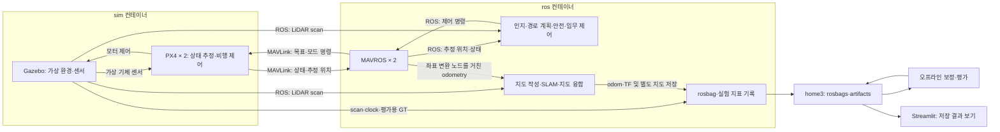

# AV_Drone 서버 구성·실행·저장 경로 안내

확인일: 2026-09-11. 아래 구조 설명과 장애 당시 수치는 최초 점검 시점의 기록입니다.
명령 예시는 설명용이며, 이 문서를 작성하면서 컨테이너를 재시작하거나 비행을 실행하지 않았습니다.

같은 날 후속 복구에서 PX4 ULog 두 개 약 347GB를 `/home3`에 백업·검증 후 원본 내용을 비워,
루트 디스크는 약 67% 사용·289GiB 여유로 회복됐습니다. 기존 sim/ros는 정지 상태입니다.
새 로그 저장 및 자동 종료 사용법은 [용량 보호 실행 안내](guarded_simulation.md)를 따릅니다.

**1. 먼저 알아둘 구성 요소**

| 이름 | 쉽게 말하면 | 현재 프로젝트에서 하는 일 |
|---|---|---|
| 서버 | 실제 컴퓨터 | 디스크·CPU·GPU를 제공 |
| Docker | 실행 환경을 나눠 관리하는 도구 | 시뮬레이션용 환경과 ROS 개발 환경을 분리 |
| Docker image | 프로그램을 설치해 둔 실행 환경 원본 | `av-drone-sim:latest`, `av-drone-ros:latest` |
| Docker container | image로 만든 실제 실행 공간 | `av_drone-sim-1`, `av_drone-ros-1` |
| Gazebo Classic | 가상 세상 | 원통·드론·센서를 만들고 물리 운동과 센서 관측을 계산 |
| PX4 SITL | 가상의 비행 제어기 | 센서로 상태를 추정하고, 목표 명령에 맞춰 드론을 제어. SITL은 비행 제어 프로그램을 PC에서 실행한다는 뜻 |
| MAVLink | 비행 제어기와 주고받는 통신 규약 | PX4의 상태와 외부 제어 명령을 전달 |
| MAVROS | ROS와 PX4 사이의 통역기 | ROS 메시지·서비스와 MAVLink를 연결 |
| ROS 2 Humble | 프로그램 사이의 메시지 기반 실행 환경 | 센서·계획·제어·SLAM 노드를 연결 |
| SLAM | 위치 추정과 지도 작성 | LiDAR 관측과 odometry를 이용해 지도와 pose를 계산 |
| rosbag | 실험 데이터 기록 파일 | 지정한 ROS 토픽을 시간 정보와 함께 저장 |
| Streamlit | 결과를 보는 웹 화면 | 저장된 실험·분석 파일을 읽어 그래프와 지도를 표시 |

Docker는 드론 제어 알고리즘이 아닙니다. Gazebo·PX4·ROS 프로그램이 실행될 환경을 관리합니다.
두 드론은 현재 한 개의 `sim` 컨테이너 안에서 시뮬레이션됩니다. 드론마다 컨테이너 하나씩인 구조는 아닙니다.

**2. 전체 연결**

아래는 자율비행 launch를 실행했을 때의 주요 정보 흐름입니다.



예를 들어 드론 1의 비행 명령은 다음 흐름으로 전달됩니다.

`local_planner → safety_monitor → autonomy_manager → MAVROS → PX4 → Gazebo의 기체 운동`

LiDAR는 Gazebo의 ROS 플러그인이 `/drone1/scan`, `/drone2/scan`으로 발행합니다.
이 LiDAR 데이터가 모두 MAVROS를 거쳐야 하는 것은 아닙니다.
PX4의 추정 위치는 MAVROS를 통해 전달되고, `pose_odom_tf`가 지도 작성에 필요한 odometry와 TF로 변환합니다.

드론 1·2의 MAVROS와 ROS 노드는 namespace로 구분합니다.
예: `/drone1/mavros/local_position/pose`, `/drone2/mavros/local_position/pose`.
PX4 연결 주소와 system ID는 swarm 설정 파일에서 드론별로 지정합니다.

**3. 서버 경로와 컨테이너 경로는 이름이 다를 수 있습니다**

가장 중요한 연결은 다음입니다.

```text
서버에서 보이는 이름
/home3/deepblue/work/AV_Drone
               ↕ 같은 실제 폴더를 연결
sim과 ros 컨테이너에서 보이는 이름
/workspace/AV_Drone
```

이 연결을 bind mount라고 부릅니다.
현재 `docker-compose.yml`의 `.:/workspace/AV_Drone` 설정으로 연결돼 있고, 실행 중인 두 컨테이너에서도 확인했습니다.
파일을 복사한 두 벌의 폴더가 아닙니다. 서버에서 파일을 수정하면 컨테이너에서도 같은 파일을 봅니다.

예를 들어 ros 컨테이너에서 다음 위치에 기록하면:

`/workspace/AV_Drone/rosbags/실험이름_slam_debug/`

서버에서는 다음 위치에서 확인합니다:

`/home3/deepblue/work/AV_Drone/rosbags/실험이름_slam_debug/`

단, 컨테이너의 모든 경로가 자동으로 home3에 연결되는 것은 아닙니다.
`/opt/PX4-Autopilot`, `/opt/ros/humble`, 컨테이너의 일반 `/tmp`는 이 프로젝트 bind mount 밖에 있습니다.

**4. 서버의 디렉터리별 역할**

아래에서 프로젝트 루트는 `/home3/deepblue/work/AV_Drone`입니다.

| 서버 경로 | 역할 |
|---|---|
| 프로젝트 루트의 `docker-compose.yml` | sim·ros 컨테이너 구성, 연결 폴더, 환경변수, 시작 명령 |
| `docker/sim/` | Gazebo·PX4 설치 방법과 시뮬레이션 시작 스크립트 |
| `docker/ros/` | ROS 2·MAVROS·SLAM 도구 설치 방법 |
| `sim_assets/worlds/` | 원통 배치 등 가상 환경의 원본 `.world` 파일 |
| `sim_assets/models/` | 드론·LiDAR 등 Gazebo 모델의 원본 |
| `src/` | 우리가 개발하는 ROS 패키지 소스 |
| `build/` | colcon 빌드 중간 산출물 |
| `install/` | 빌드한 패키지를 실행·검색할 때 사용하는 설치 결과 |
| `log/` | colcon 빌드 로그. 모든 실행 로그가 이곳에 모이는 것은 아님 |
| `rosbags/` | 센서·odom·TF·GT 등 선택한 토픽의 원본 기록 |
| `artifacts/` | 실험 지표, 지도 스냅샷, 보정 결과, 그래프 |
| `experiments/` | 실험 장부·보고서 및 과거 실험별 자료 |
| `scripts/` | 분석·그림 생성·대시보드 실행 도구 |
| `docs/` | 실험 설명, 개발 계획, 사용 문서 |
| `dashboard_archive/` | 이전 대시보드·실험 자료 보관 |
| `.cache/gz/av_drone_multi_models/` | 다음 2대 시뮬레이션 시작 시 생성할 드론별 실행용 모델 설정 |

새 `.cache/gz/` 폴더는 실행 시 만들어집니다. 확인 당시 아직 존재하지 않았습니다.
Git과 Docker 빌드 대상에서는 제외됩니다. 생성 설정파일은 재실행 시 전용 폴더 안에서 다시 만들어집니다.

| 프로젝트 밖의 서버 경로 | 역할 |
|---|---|
| `/var/lib/docker/` | 이 서버 Docker의 실제 저장소. image, 컨테이너 내부 변경 데이터, volume, 컨테이너 로그 등을 보관 |
| `/var/lib/docker/volumes/av_drone_sim-home/_data/` | sim 컨테이너의 `/root`에 연결된 별도 volume |
| `/tmp/` | 서버 프로그램과 실행 도구가 쓰는 공용 임시 공간 |
| `/tmp/.X11-unix/` | GUI 화면 연결용 소켓. 두 컨테이너에 연결되며 rosbag 저장 폴더가 아님 |

Docker 저장소 아래의 내부 파일을 프로젝트 소스처럼 직접 편집하는 방식은 사용하지 않습니다.

**5. 컨테이너 안의 주요 경로**

| 컨테이너 경로 | 어느 컨테이너인가 | 용도와 실제 저장 위치 |
|---|---|---|
| `/workspace/AV_Drone` | sim·ros 모두 | 서버 home3의 프로젝트 폴더 |
| `/opt/PX4-Autopilot` | sim | PX4 소스와 시뮬레이션 도구. Docker 저장소에 보관 |
| `/opt/PX4-Autopilot/build/px4_sitl_default` | sim | PX4 실행파일과 빌드 결과. 프로젝트의 `build/`와 별개 |
| `/opt/PX4-Autopilot/build/px4_sitl_default/rootfs/2`, `rootfs/3` | sim의 현재 2대 설정 | 각 PX4 인스턴스 작업 폴더. stdout·stderr 로그 등 |
| `/opt/ros/humble` | sim·ros 각각 | 각 컨테이너에 설치된 ROS 실행 환경 |
| `/root` | sim | `av_drone_sim-home` volume. Gazebo 사용자 설정 등이 저장될 수 있음 |
| `/root` | ros | 현재 별도 home volume이 없는 컨테이너 내부 사용자 홈 |
| `/root/.ros/log` | ROS 프로그램 실행 컨테이너 | 별도 로그 경로 지정이 없을 때 ROS 실행 로그의 일반적인 기본 위치 |
| `/tmp/av_drone_multi_models` | 이전 sim 시작 방식 | 드론별 생성 설정파일의 기존 위치 |
| `/workspace/AV_Drone/.cache/gz/av_drone_multi_models` | 변경 후 sim 시작 방식 | 생성 설정파일을 home3에 저장하도록 바꾼 위치 |

서버의 `/tmp`와 컨테이너의 `/tmp` 전체는 같은 폴더가 아닙니다.
현재 명시적으로 공유하는 것은 `/tmp/.X11-unix` 하위 경로입니다.
컨테이너의 일반 임시파일도 현재 Docker 저장소가 시스템 디스크에 있기 때문에 그 디스크 공간을 사용합니다.

컨테이너의 `/root`는 그 컨테이너 안의 root 사용자 홈입니다.
서버 관리자 계정의 `/root`와 자동으로 같은 폴더가 되는 것은 아닙니다.

**6. src 안에서 어디를 수정하는가**

| 패키지·위치 | 주로 수정할 내용 |
|---|---|
| `src/drone_bringup/launch/` | 어떤 노드를 어떤 설정으로 함께 실행할지 |
| `src/drone_bringup/config/` | 드론 시작 배치, 목표점, 통신 주소, 기록 여부, planner 설정 |
| `src/drone_perception/` | LiDAR 기반 장애물 정보 추출 |
| `src/drone_planning/` | 목표 방향·장애물을 고려한 이동 명령 계산 |
| `src/drone_safety/` | 이동 명령에 대한 안전 제한 |
| `src/drone_control/` | 이륙·이동·도착 등 임무 상태와 MAVROS 제어 |
| `src/drone_slam/` | pose·odom·TF 연결, known-pose 지도, SLAM 상태와 지도 저장 |
| `src/drone_map_fusion/` | 여러 드론 지도를 공통 격자에 합치는 실시간 노드 |
| `src/drone_cslam/` | rosbag 기반 상대 pose, pose graph 보정, 지도 재구성·평가 |
| `src/drone_metrics/` | metrics.csv, trajectory.csv, summary.json 등 기록 |
| `src/ros_states/` | ROS 상태 모니터링 도구 |
| `scripts/quant_dashboard.py` | Streamlit 결과 화면 |

현재 70m 실험 설정 파일은
`src/drone_bringup/config/swarm_two_uav_phase2_70m.yaml`입니다.
이 파일은 두 드론의 local goal을 정하는 구조이며, 여러 공통 관측 구역을 지나는 경유점 경로는 앞으로 추가할 개발 범위입니다.

PX4 프로그램 전체를 수정할 때는 sim 컨테이너의 PX4 소스가 대상이지만,
우리 자율비행·SLAM 연구 코드의 일반적인 수정 위치는 프로젝트의 `src/`입니다.

**7. 실행 단계와 터미널 위치**

서버에 SSH로 접속한 터미널은 처음에는 서버 호스트의 셸입니다.
`docker compose exec ros bash`를 실행하면 같은 터미널에서 ros 컨테이너의 셸로 들어갑니다.
그 안에서 `exit`하면 서버 셸로 돌아옵니다.

현재 시스템 디스크가 가득 찼으므로, 아래 실행 순서는 디스크 문제를 해결한 뒤 사용하는 예시입니다.

서버 터미널에서 컨테이너를 준비합니다.

```bash
cd /home3/deepblue/work/AV_Drone
HEADLESS=1 VEHICLE_COUNT=2 PX4_SITL_WORLD=random_cylinders_double docker compose up -d sim ros
docker compose ps
```

`sim`은 Gazebo·PX4 시작 스크립트를 실행합니다.
`ros`는 `sleep infinity`로 대기합니다. 이 시점만으로 자율비행이나 rosbag 기록이 시작되는 것은 아닙니다.
이 예시는 GUI 없는 2대 구성이며, 실제로 현재 sim 스크립트의 다중 드론 분기는 2대를 지원합니다.

서버 터미널에서 ros 컨테이너에 들어갑니다.

```bash
docker compose exec ros bash
```

이제 ros 컨테이너 안에서 ROS 환경을 준비하고 패키지를 빌드합니다.

```bash
source /opt/ros/humble/setup.bash
cd /workspace/AV_Drone
colcon build --packages-select drone_bringup drone_control drone_perception drone_planning drone_safety drone_metrics drone_slam drone_map_fusion drone_cslam ros_states --symlink-install
source install/setup.bash
```

같은 ros 컨테이너 셸에서 현재 70m 실험 launch를 실행합니다.

```bash
ros2 launch drone_bringup multi_drone_slam_fusion.launch.py \
  manifest:=/workspace/AV_Drone/src/drone_bringup/config/swarm_two_uav_phase2_70m.yaml
```

이 launch가 MAVROS, 인지·계획·제어, 지도 작성, 지도 융합, 기록 노드를 시작합니다.
현재 70m manifest는 diagnostics와 rosbag 기록을 켜 둔 상태입니다.
별도 run_id를 주지 않으면 실행 시각 등을 이용한 이름을 자동으로 만듭니다.

| 명령 | 실제 의미 |
|---|---|
| `cd 경로` | 현재 셸의 작업 폴더 변경 |
| `source /opt/ros/humble/setup.bash` | 현재 셸이 ROS 기본 프로그램을 찾도록 환경 설정 |
| `colcon build ...` | 프로젝트 소스를 빌드·설치. 비행 시작 명령이 아님 |
| `source install/setup.bash` | 현재 셸이 이 프로젝트의 패키지를 찾도록 환경 설정 |
| `ros2 launch ...` | 관련 ROS 프로그램을 함께 실행 |
| `docker compose logs --tail 100 sim` | sim 컨테이너 표준 출력 로그 확인 |
| `docker compose exec ros bash` | 실행 중인 ros 컨테이너에 새 셸 열기 |

현재 ros 이미지·컨테이너에는 자동 setup을 수행하는 ENTRYPOINT가 연결돼 있지 않습니다.
`docker/ros/entrypoint.sh` 파일은 존재하지만, 그것이 있다는 이유만으로 자동 적용되지는 않습니다.
따라서 새 ros 셸을 열면 위 source 명령을 실행하는 방식이 명확합니다.

기존 `single_drone_autonomy.launch.py`는 1대용 실행 진입점입니다.
현재 70m 2대 지도 실험은 `multi_drone_slam_fusion.launch.py`와 swarm manifest를 사용합니다.

**8. 실험 기록과 분석 결과는 어디에 생기는가**

아래는 서버의 프로젝트 폴더를 기준으로 한 예시입니다.

```text
AV_Drone/
├── rosbags/
│   └── 실행이름_slam_debug/
│       ├── metadata.yaml
│       └── ... .db3
└── artifacts/
    └── 실행이름/
        ├── drone1/
        │   ├── metrics.csv
        │   ├── trajectory.csv
        │   ├── summary.json
        │   └── maps/
        ├── drone2/
        │   └── ...
        ├── swarm/
        │   └── maps/
        ├── oracle_correction/
        └── lidar_registration/
```

마지막 두 분석 폴더는 오프라인 평가 프로그램을 해당 출력 경로로 실행했을 때 생깁니다.
비행 launch만 실행한다고 Oracle·LiDAR 보정 분석까지 자동 실행되지는 않습니다.
일부 요약 파일은 정상 종료 등 해당 저장 시점에 생성되므로 실행 도중과 종료 후 파일 구성이 다를 수 있습니다.

현재 70m rosbag 기록 대상은 `/tf`, `/tf_static`, `/clock`,
드론별 `scan`, `odom`, 그리고 설정이 켜진 `ground_truth/odom`입니다.
선택된 토픽만 기록하며, 모든 ROS 메시지를 자동으로 저장하지 않습니다.
지도 스냅샷은 별도 recorder가 artifacts의 maps 폴더에 기록합니다.

이전 70m 실제 데이터는 다음 위치입니다.

- `rosbags/2026-08-27_lidar_phase2_70m_codex_v1_slam_debug/`
- `artifacts/2026-08-27_lidar_phase2_70m_codex_v1/`

현재 70m 설정의 실시간 통합 지도는 known-pose 지도들을 초기 배치에 맞춰 합칩니다.
known-pose 지도에 쓰는 위치는 PX4/MAVROS 추정 위치이며, Gazebo GT와 다릅니다.
Oracle·LiDAR 보정 결과는 오프라인 pose graph 최적화와 scan 재투영으로 만들어집니다.
아직 이 보정 결과가 비행 중 실시간 통합 지도로 되돌아가는 구조는 아닙니다.

**9. Streamlit은 어디서 실행하는가**

기존 실행 스크립트는 프로젝트 루트를 찾아 저장된 자료를 읽습니다.
서버 호스트에서 실행하는 사용 예시는 다음과 같습니다.

```bash
cd /home3/deepblue/work/AV_Drone
bash scripts/run_quant_dashboard.sh
```

기본 바인딩은 `0.0.0.0:8501`입니다.
`0.0.0.0`은 프로그램이 서버의 네트워크 인터페이스에서 접속을 받는다는 설정이고,
로컬 PC 브라우저에 입력할 서버 주소는 `http://서버주소:8501`입니다.
실제 접속 가능 여부는 서버 네트워크·방화벽 설정에 따릅니다.

Streamlit은 결과를 보는 화면입니다. 기존 결과 열람에는 Gazebo 비행을 다시 실행할 필요가 없습니다.
이 문서 작성에서는 Streamlit의 현재 실행 여부나 외부 접속을 검사하지 않았습니다.

두 컨테이너는 현재 `network_mode: host`를 사용합니다.
따라서 컨테이너 안의 네트워크는 서버의 네트워크 공간을 공유합니다.
로컬 PC 브라우저의 `localhost`는 로컬 PC 자신이므로, 서버와 같은 뜻으로 사용하면 안 됩니다.

**10. 이번 tmp 문제와 현재 실행 상태**

확인 시점의 디스크 전체 상태는 다음과 같습니다. 계정별 quota를 측정한 값은 아닙니다.

| 파일시스템 | 전체 | 사용 | 남음 |
|---|---:|---:|---:|
| home3 디스크 `/dev/sda` | 3.6TB | 909GB | 약 2.6TB |
| 시스템 디스크 `/dev/nvme0n1p2` | 916GB | 916GB | 0 |

서버 `/tmp`와 `/var/lib/docker`는 모두 시스템 디스크에 있습니다.
그래서 home3에 실험 데이터를 기록하더라도 프로그램 시작 자체는 시스템 디스크 부족의 영향을 받을 수 있습니다.

이 대화에서 실제 관측한 오류는 두 종류입니다.

- 명령 실행 도구가 서버 `/tmp/.git` 임시 마운트 지점을 준비하다 공간 부족으로 실패.
- `docker exec`가 서버 `/tmp/runc-process…` 임시파일을 만들지 못해 실패.

드론별 모델 설정의 새 home3 경로는 다음 sim 시작부터 적용됩니다.
확인 당시 sim은 약 2주 전 시작된 프로세스가 계속 실행 중이었고 새 캐시 폴더는 아직 없었습니다.
이번 문서 작성에서는 재시작하지 않았으며, 컨테이너 내부 이전 캐시의 용량 조회는 위 docker exec 오류로 실패했습니다.

확인 당시 실행 중인 것은 다음과 같습니다.

- `sim`: Gazebo 서버 `gzserver` 1개와 PX4 프로세스 2개.
- `ros`: 대기용 `sleep` 프로세스. 이 컨테이너 안의 MAVROS·자율비행·SLAM·rosbag 프로세스는 실행 중이지 않았음.

생성 모델 경로 변경만으로 Docker 전체 저장 위치가 바뀌지는 않습니다.
이 최초 점검 이후 주된 원인은 PX4 인스턴스 2·3의 장기 실행 ULog로 특정했고, 위 후속 복구를 완료했습니다.

**확인에 사용한 주요 파일**

- [Docker 컨테이너 구성](../docker-compose.yml)
- [sim 시작 스크립트](../docker/sim/entrypoint.sh)
- [2대 PX4·Gazebo 실행 스크립트](../docker/sim/multi_px4_entrypoint.sh)
- [ROS 이미지 구성](../docker/ros/Dockerfile)
- [2대 지도 실험 launch](../src/drone_bringup/launch/multi_drone_slam_fusion.launch.py)
- [70m 설정](../src/drone_bringup/config/swarm_two_uav_phase2_70m.yaml)
- [지도 저장 코드](../src/drone_slam/drone_slam/map_artifact_recorder_node.py)
- [실험 지표 기록 코드](../src/drone_metrics/drone_metrics/metrics_logger_node.py)
- [Streamlit 실행 스크립트](../scripts/run_quant_dashboard.sh)
- [기존 70m 실험·분석 명령](lidar_phase2_70m_experiment.md)
