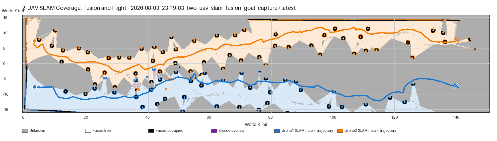
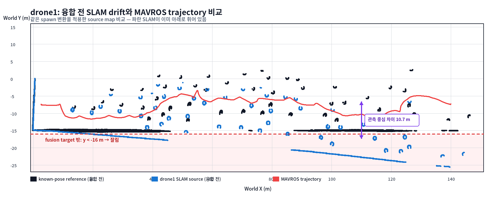
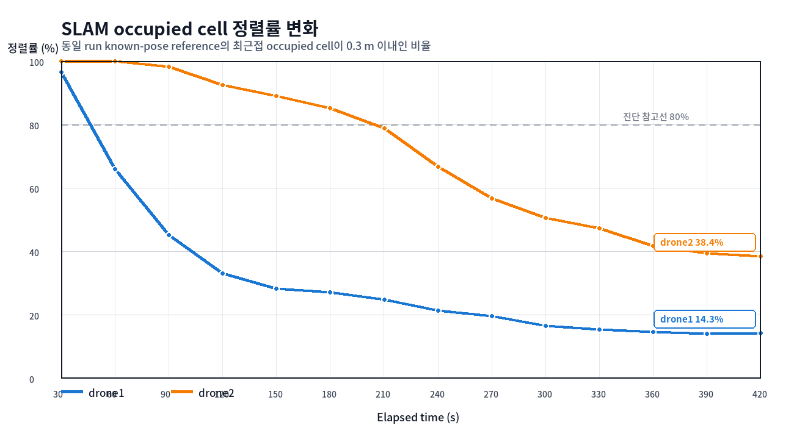

# 2-UAV SLAM 형상 불일치 원인 분석

> 분석 대상: `2026-08-03_23-19-03_two_uav_slam_fusion_goal_capture`  
> 작성일: 2026-08-04 KST  
> 분석 범위: drone1/drone2 실제 `slam_toolbox` 지도, known-pose reference, MAVROS trajectory, 중앙 fused map

## 1. 결론

파란 trajectory와 파란 SLAM 영역이 분리된 주원인은 **융합 좌표변환 오류가 아니라 drone1 `slam_toolbox`의 장거리 scan-matching drift**다.

확인된 사실은 다음과 같다.

1. drone1의 융합 변환은 `(x=3.0 m, y=-7.5 m, yaw=0 rad)`이다. 융합은 회전 없이 고정 translation만 적용한다.
2. 융합 전의 drone1 source SLAM부터 known-pose reference 아래로 휘어 있다.
3. 정렬 오차는 처음부터 일정하지 않고 비행 시간과 거리에 따라 누적된다.
4. drone1 SLAM 관측 영역은 최종적으로 world y=-25.54 m까지 내려가지만 fused grid 하한은 y=-16 m이므로 아래쪽이 잘린다.
5. 이미지의 trajectory는 MAVROS odometry 기준이고 SLAM map은 `map→odom` scan-matching 보정이 반영된 map frame 기준이다. 두 선의 분리는 SLAM localization drift를 가시화한다.

따라서 현재 형상은 다음 두 현상이 합쳐진 결과다.

> **잘못 누적된 SLAM heading/횡방향 보정 + fused grid 경계 clipping**

## 2. 현재 SLAM·융합·비행 경로 이미지



색상 의미:

- 파란 선: drone1 MAVROS trajectory
- 주황 선: drone2 MAVROS trajectory
- 파란/주황 음영: 각 드론의 SLAM 관측 영역
- 파란/주황 외곽: 각 source의 occupied cell halo
- 검정: fused occupied cell
- 회색: unknown cell
- 보라: 두 source의 관측 중첩 영역

파란 trajectory가 파란 SLAM 영역의 중심과 일치하지 않는 것은 같은 데이터를 두 번 다르게 그린 문제가 아니다. trajectory와 SLAM map이 서로 다른 추정 결과를 나타내며, 장거리에서 SLAM 쪽 추정이 아래로 누적 이동했다.

## 3. 융합 전 source map 비교



이 그림은 fused map을 사용하지 않는다. 다음 세 데이터만 동일한 spawn transform으로 world 좌표에 그렸다.

- 검정: 같은 LaserScan과 known pose로 생성한 reference occupied cell
- 파랑: `slam_toolbox`가 생성한 drone1 source occupied cell
- 빨강: MAVROS trajectory

파란 source SLAM이 x 증가에 따라 아래로 내려가기 때문에 오차가 융합 전에 이미 존재한다. x=100~120 m 구간에서 관측 영역 중심 차이는 약 **10.74 m**다.

빨간 점선 아래는 fused grid 범위 밖이다. 융합기는 y<-16 m 셀을 잘못 이동시키는 것이 아니라 target grid에 포함할 수 없어 제외한다. 이 clipping 때문에 최종 fused 그림에서는 파란 영역 아래쪽이 잘린 쐐기 모양으로 보인다.

## 4. 시간에 따른 정렬률 변화



정렬률은 각 SLAM occupied cell에서 같은 run의 known-pose reference occupied cell까지 최근접 거리를 구하고, 거리가 0.3 m 이내인 cell의 비율로 계산했다.

| 시간 (s) | drone1 정렬률 | drone1 중앙 오차 (m) | drone2 정렬률 | drone2 중앙 오차 (m) |
|---:|---:|---:|---:|---:|
| 30 | 96.49% | 0.050 | 100.00% | 0.041 |
| 60 | 65.87% | 0.069 | 100.00% | 0.040 |
| 90 | 45.11% | 0.372 | 98.19% | 0.014 |
| 120 | 33.07% | 0.811 | 92.45% | 0.032 |
| 150 | 28.33% | 1.059 | 89.03% | 0.068 |
| 180 | 27.11% | 1.150 | 85.22% | 0.108 |
| 210 | 24.74% | 1.287 | 78.88% | 0.108 |
| 240 | 21.33% | 1.476 | 66.71% | 0.132 |
| 270 | 19.66% | 1.621 | 56.68% | 0.205 |
| 300 | 16.59% | 1.772 | 50.51% | 0.254 |
| 330 | 15.41% | 1.897 | 47.22% | 0.308 |
| 360 | 14.69% | 1.895 | 41.70% | 0.443 |
| 390 | 13.99% | 1.973 | 39.50% | 0.476 |
| 420 | 14.33% | 1.957 | 38.40% | 0.522 |

고정된 spawn/fusion transform이 틀렸다면 30초 map부터 비슷한 크기의 오차가 나타나야 한다. 실제로는 drone1이 30초 96.49%에서 420초 14.33%까지 점진적으로 악화됐다. 이는 정적 fusion transform보다 scan matching의 누적 오차와 일치한다.

## 5. 공간 범위 수치

| 데이터 | world x 관측 범위 (m) | world y 관측 범위 (m) | 관측 cell 수 |
|---|---:|---:|---:|
| drone1 SLAM | -0.18 ~ 144.42 | **-25.54 ~ 0.06** | 113,756 |
| drone1 known-pose reference | -0.25 ~ 147.75 | **-15.45 ~ 4.65** | 223,744 |
| drone2 SLAM | 0.15 ~ 146.35 | -8.78 ~ 14.92 | 114,741 |
| drone2 known-pose reference | 0.05 ~ 147.85 | -10.75 ~ 15.25 | 225,901 |

drone1의 SLAM y 최솟값은 reference보다 약 10.09 m 낮다. 반면 drone2는 같은 방향의 대규모 하강은 없지만 정렬률이 420초에 38.40%까지 떨어져 별도의 scan-matching drift가 존재한다.

## 6. 좌표 처리 과정

### 6.1 Trajectory

```text
MAVROS local_position/pose
  → droneN/odom 좌표의 trajectory.csv
  → manifest spawn translation 적용
  → swarm_map 위의 비행 경로
```

drone1은 `(3.0, -7.5, 0.0)`, drone2는 `(3.0, 7.5, 0.0)`의 world transform을 적용한다.

### 6.2 SLAM map

```text
LaserScan + MAVROS odometry prior
  → slam_toolbox scan matching
  → 동적 map→odom 보정
  → droneN/map OccupancyGrid
  → 동일한 manifest spawn transform 적용
  → swarm_map으로 투영
```

융합기는 source OccupancyGrid의 origin과 yaw를 먼저 적용하고 그 다음 spawn transform을 적용한다. 이 run에서 source spawn yaw는 모두 0이다.

### 6.3 Fusion

```text
drone1 SLAM projected cells ─┐
                             ├─ freshness/confidence weighted log-odds
drone2 SLAM projected cells ─┘
                             → fused OccupancyGrid [-1,151]×[-16,16] m
```

fusion 상태 `HEALTHY`는 두 source가 최신 상태로 도착했고 계산이 수행됐다는 뜻이다. source map이 실제 월드와 정확히 정렬됐다는 품질 보증은 아니다.

이번 run의 fusion 수치는 다음과 같다.

- map version: 443
- mission 중 active source: drone1, drone2
- fusion latency p95: 64.45 ms
- 최종 conflict ratio: 약 0.0526%
- fused coverage: 40.53%

낮은 conflict ratio 역시 두 잘못된 지도가 서로 충돌하지 않는 위치에 있을 수 있으므로 월드 정확도를 보증하지 않는다.

## 7. 가장 유력한 알고리즘 원인

직접 확인된 현상은 `slam_toolbox` 출력의 누적 drift다. 세부 메커니즘으로는 다음 조합이 가장 유력하다.

1. 긴 단방향 이동으로 같은 장소를 다시 방문하지 않아 loop closure로 heading 오차를 교정할 기회가 없다.
2. 긴 통로와 반복되는 원통 장애물이 비슷한 LaserScan 형상을 만들어 잘못된 scan correspondence가 선택될 수 있다.
3. 작은 heading 보정 오류가 전진 거리에 비례해 큰 y 오차로 확대된다. 최종 형상은 대략 4~6° 수준의 유효 시계 방향 오차와 유사하다.
4. 각 드론이 독립된 `slam_toolbox`를 사용하므로 같은 world에서도 drift 방향과 크기가 다르다.

단, 어떤 scan 순번에서 잘못된 match가 처음 선택됐는지를 이 artifact만으로 단정할 수는 없다. 현재 run에는 시간별 `map→odom` TF와 scan matcher response/pose graph constraint가 저장되지 않았기 때문이다.

## 8. 수정 및 추가 계측 우선순위

1. 시간별 `map→odom` translation/yaw를 artifact로 저장한다.
2. Streamlit에 MAVROS odom trajectory와 SLAM-corrected trajectory를 동시에 표시한다.
3. scan matching의 yaw/거리 보정 허용폭과 odometry penalty를 작은 범위에서 한 항목씩 조정한다.
4. 30~60초 짧은 구간에서 drift 기울기를 비교한 뒤 전체 420초 run을 재검증한다.
5. 최종 Gate는 단순 fusion `HEALTHY`가 아니라 reference 0.3 m 정렬률과 map→odom yaw drift를 함께 사용한다.

## 9. 판정

| 항목 | 판정 | 근거 |
|---|---|---|
| 두 드론 목표 도달 | PASS | drone1/2 모두 `HOVER_AT_GOAL`, `goal_reached=true` |
| 실제 SLAM map 생성 | PASS | 두 `slam_toolbox` map과 14개 history 저장 |
| 중앙 fusion 동작 | PASS | mission 중 source 2개 active, `HEALTHY` |
| fusion 좌표변환 | PASS | 초기 정렬 양호, static yaw=0, known transform 적용 확인 |
| 장거리 SLAM 정렬 품질 | **FAIL** | 최종 정렬률 drone1 14.33%, drone2 38.40% |
| global navigation용 map 사용 | **보류** | drift 개선 전에는 fused map을 world truth로 사용하면 안 됨 |

## 10. 관련 파일

- 실행 artifact: `artifacts/2026-08-03_23-19-03_two_uav_slam_fusion_goal_capture/`
- fusion projection: `src/drone_map_fusion/drone_map_fusion/occupancy_grid_utils.py`
- multi-UAV launch/transform: `src/drone_bringup/launch/multi_drone_slam_fusion.launch.py`
- SLAM 설정: `src/drone_slam/config/slam_toolbox_async.yaml`
- 실행 요약: `experiments/run_reports/2026-08-03_23-19-03_two_uav_slam_fusion_goal_capture.json`

