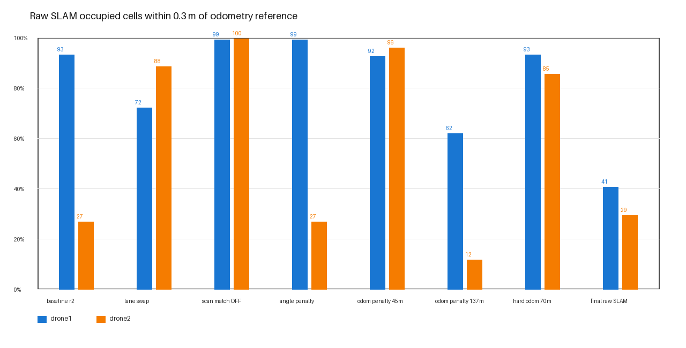
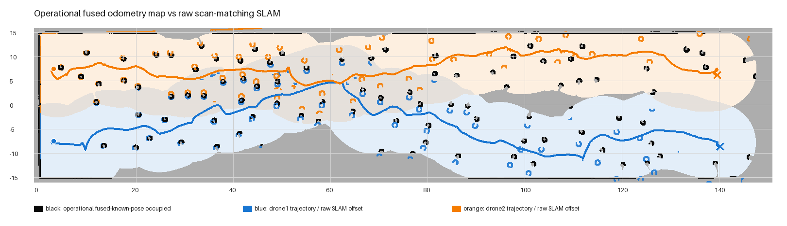
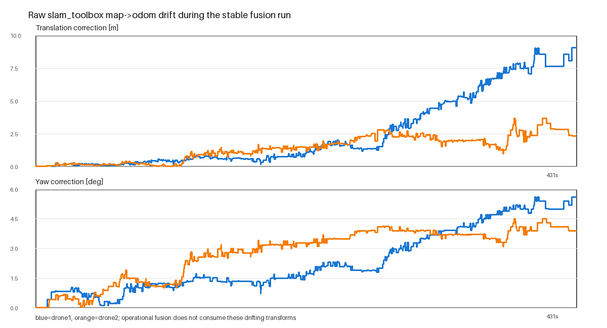

# 2-UAV SLAM drift 원인 분리 및 operational fallback 보고서

> 기준일: 2026-08-04 KST  
> 최종 검증 run: `2026-08-04_03-00-47_slam_diag_stable_fusion_full`  
> 판정: **비행·operational map fusion PASS / raw scan-matching SLAM FAIL**

## 결론

문제 이미지는 map fusion이 두 지도를 잘못 합쳐서 생긴 것이 아니다. 각 드론의 `slam_toolbox`가 scan matching 과정에서 잘못된 `map→odom` 보정을 누적했고, fusion은 이미 틀어진 각 로컬 SLAM map을 지정된 spawn transform으로 정상 투영했다.

TF frame 계약, spawn transform, timestamp 역행, fusion 투영을 각각 분리한 결과 주원인은 **Karto 기반 `slam_toolbox` scan matching의 환경·실행별 비결정적 drift**였다. scan matching을 끈 대조군은 두 드론 모두 99% 이상 정렬됐지만, scan matching을 켜면 기체 ID나 lane을 바꿔도 어느 한쪽에서 translation/yaw 보정이 누적됐다.

파라미터 튜닝은 단거리 또는 중거리에서 성공해도 독립 full 반복에서 다시 실패했다. 따라서 성공한 단발 tuning을 기본값으로 채택하지 않았다. 최종 operational 구성은 다음처럼 명시적으로 분리했다.

```text
MAVROS local pose + LaserScan
├─ odometry-based known_pose mapper ──> operational 2-UAV fusion
└─ raw slam_toolbox (scan matching ON) ──> 진단 기록/Streamlit 비교 전용
```

`known_pose`라는 코드 명칭은 Gazebo ground truth를 뜻하지 않는다. 현재 노드는 정규화된 MAVROS local odometry pose와 LaserScan으로 occupancy map을 만든다.

## 핵심 증거



- baseline 반복에서 같은 설정도 0.3 m 정렬률이 25.5~93.1%로 크게 변했다.
- lane swap 후 오류 경향이 lane을 따라가기도 했지만, no-loop 반복에서는 반대 기체가 먼저 실패했다. 특정 drone1 하드웨어/namespace 문제로 고정할 수 없다.
- scan matching OFF 대조군은 drone1 99.1%, drone2 99.5%였다.
- angle-only는 yaw를 억제했지만 문제 기체의 translation 2.304 m와 정렬률 26.7%를 해결하지 못했다.
- 완화된 odometry penalty는 45 m에서 92.4%/95.8%였지만 137 m에서 61.7%/11.5%로 붕괴했다.
- 강한 penalty도 70 m에서 93.0%/85.3%였으나 독립 full 반복의 x≈29 m에서 두 기체 translation이 이미 약 1.5 m가 되어 재현성 Gate를 실패했다.

## Karto 구현과 수치 원인

공식 [Slam Toolbox 저장소](https://github.com/SteveMacenski/slam_toolbox)는 scan matching으로 odometry pose를 보정하고 `map→odom` 변환을 제공한다고 설명한다. 포함된 Karto 구현의 [Mapper.cpp](https://raw.githubusercontent.com/SteveMacenski/slam_toolbox/ros2/lib/karto_sdk/src/Mapper.cpp)와 [Mapper.h](https://raw.githubusercontent.com/SteveMacenski/slam_toolbox/ros2/lib/karto_sdk/include/karto_sdk/Mapper.h)를 대조하면 scan 후보 응답은 다음과 같이 odometry 중심으로부터의 거리와 각도에 따라 감점된다.

```text
distancePenalty = max(1 - 0.2 * squaredDistance / distanceVariance, minimumDistancePenalty)
anglePenalty    = max(1 - 0.2 * squaredAngle / angleVariance, minimumAnglePenalty)
response       *= distancePenalty * anglePenalty
```

기본 설정은 위치 검색 끝에서도 감점이 작고, 최소 각도 penalty가 0.9라 잘못된 후보도 최대 10%만 감점한다. 더 중요한 점은 near-chain graph match와 loop-closure match가 Karto 코드에서 `doPenalize=false`로 호출된다는 것이다.

다음 조건을 단계별로 시험했다.

1. 각도 penalty 강화
2. 거리 penalty 강화
3. near-chain 연결 반경 축소
4. loop closure 비활성화
5. 1 cm translation 후보부터 최저 penalty를 주는 hard-odometry 설정
6. hard-odometry + near-chain 차단 + loop closure 차단 조합

실행 중 `ros2 param get`으로 실제 노드에 모든 값이 주입된 것도 확인했다. 그럼에도 독립 반복에서 drift가 재발했다. 즉 launch override 누락이 아니라 scan response/pose graph가 특정 관측 배열에서 odometry보다 잘못된 일치를 선택하는 것이 원인이다.

## 최종 full run



검정 occupied map은 operational `fused_known_pose`, 파랑·주황 선과 어긋난 장애물 외곽은 같은 실행에서 병렬 기록한 raw SLAM/trajectory이다.

| 항목 | drone1 | drone2 |
|---|---:|---:|
| 137 m 목표 도달 | PASS | PASS |
| 최종 local pose | (137.20, -1.06) m | (136.63, -1.25) m |
| raw SLAM 0.3 m 정렬률 | 40.6% | 29.3% |
| raw SLAM median 거리 | 0.577 m | 1.053 m |
| raw map→odom translation | 9.063 m | 1.929 m |
| raw map→odom yaw | -5.599° | +3.700° |

Operational fusion 결과:

- 상태: `HEALTHY`
- 두 source active: 430 sample
- `LOCAL_ONLY_FALLBACK`: 0회
- fusion latency p95: 101.09 ms
- 최종 conflict ratio: 0.001017
- 관측 범위: world x=-0.05~147.65 m, y=-15.15~15.15 m
- occupied cell: 5,522
- observed cell: 388,485



이 그림은 operational fusion이 정상이어도 raw `slam_toolbox`의 translation/yaw 보정은 계속 누적된다는 것을 보여준다. fallback은 이 오류를 숨기지 않고 별도 artifact와 Streamlit 레이어로 보존한다.

## 구현 변경

- `slam_tf_diagnostics` 노드 추가: `/tf`, odom, scan timing과 `map→odom` correction을 CSV/JSON으로 기록
- 조건별 manifest/격리 실행기 추가: baseline 반복, lane swap, scan matching OFF, tuning 단계, full run
- 실행 전 두 FCU `connected=True` 검증 및 PX4 stdout/stderr 보존
- 분석기가 누락 map/FCU 실패를 `invalid`로 분리하도록 수정
- 기본 2-UAV fusion source를 `known_pose`로 전환
- raw `slam_toolbox`는 계속 실행하고 `slam_grid.npy/pgm`과 history를 병렬 저장
- Streamlit에서 `known_pose`, `raw slam`, `fused_known_pose`, trajectory를 같은 시점에 선택·비교하도록 수정
- fused source 명칭에 맞는 입력만 conflict 계산에 사용하도록 수정
- 실행명은 계속 `YYYY-MM-DD_HH-MM-SS_알고리즘` 형식을 사용

## Streamlit에서 확인

```bash
streamlit run scripts/quant_dashboard.py \
  --server.address 0.0.0.0 \
  --server.port 8501 \
  -- --repo-root /home3/deepblue/work/AV_Drone
```

브라우저 주소:

```text
http://166.104.230.197:8501
```

`SLAM & Fusion Debug` 탭에서 run `2026-08-04_03-00-47_slam_diag_stable_fusion_full`을 선택한다. 기본 레이어는 다음 다섯 개다.

- `drone1/known_pose`
- `drone1/slam`
- `drone2/known_pose`
- `drone2/slam`
- `swarm/fused_known_pose`

## 해석 제한과 다음 단계

현재 operational PASS를 “SLAM fusion 성공”이라고 부르면 안 된다. 정확한 명칭은 **odometry-based map fusion with raw SLAM diagnostics**다. 실제 scan-matching SLAM을 operational source로 복귀하려면 다음 중 하나를 별도 연구 Gate로 진행해야 한다.

- IMU/VIO/GPS covariance를 pose graph에 정식 constraint로 넣을 수 있는 SLAM backend 검토
- Cartographer 등 odometry prior 가중치를 명시할 수 있는 알고리즘과 동일 rosbag 비교
- 2D UAV LiDAR의 roll/pitch projection 오차 검증 및 deskew/IMU 보정
- 동일 seed 반복 run으로 137 m 정렬률 분포와 실패 확률 보고

단일 성공 run만으로 raw SLAM을 다시 fusion 입력으로 승격하지 않는다.
